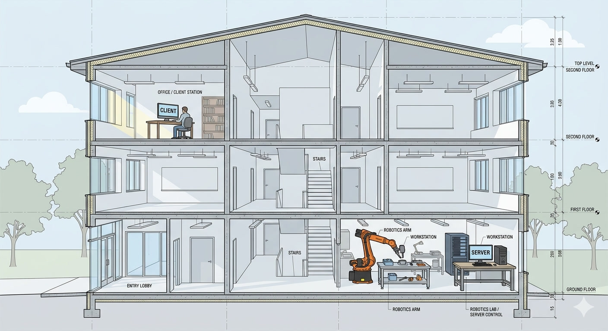
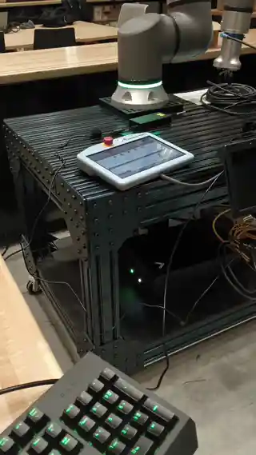
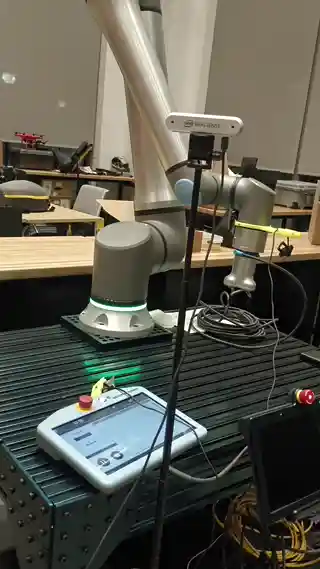

 
  
# Client-Server Robotic Remote Control System

  
  

A client–server robotic remote control system where the server connects directly to the robot (UR20) and executes control commands, while the client provides a remote interface for real-time teleoperation.  
This is a demonstration for visitors, conducted at the ProCon Innovation Center, Myers-Lawson School of Construction, Virginia Tech.

  
   
  
   
  
  

